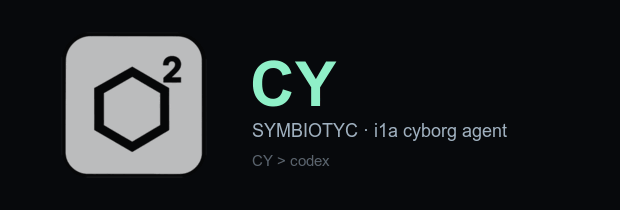

# CY

**Cyborg-агент для кода. Контур SYMBIOTYC / CY i1a.**

[Сайт](https://symbiotyc.dev) · [Исходники](https://github.com/Symbiotyc/CYIDE) · [Проблемы](https://github.com/Symbiotyc/CYIDE/issues)

---

## CY > codex

**о приоре.**

Похожий codex по сравнению с CY нервно курит в сторонке. Это не сравнение, а разные весовые категории: CY как минимум **в 2 раза лучше** — по автономности, по скорости входа в задачу и по тому, сколько работы он доводит до конца без вашего участия.

---

## Что это

CY — автономный агент разработки, который живёт прямо в редакторе. Он читает проект, сам решает, что посмотреть, запускает команды, правит файлы и показывает результат. Вы остаётесь ведущим: видите каждую команду и каждый диff.

Контур **CY i1a** закреплён: никаких списков моделей, никакого выбора провайдера, никакой настройки ключей. Установили — работает.

## Возможности

- **Автономный ход.** Ставите задачу словами — CY сам разбирает проект, правит код и проверяет себя.
- **Живой контекст.** Понимает структуру репозитория без ручного указания файлов.
- **Терминал под контролем.** Команды выполняются в песочнице, каждая видна до запуска.
- **Разбор кода.** Отдельный режим ревью — в текущем чате или в отдельном.
- **Глубина размышления.** Уровень раздумывания переключается прямо в чате, под задачу.
- **Закреплённый контур.** SYMBIOTYC / CY i1a — всегда видно, что работает, и это не подменить.

## Быстрый старт

1. Установите CY.
2. Откройте панель: `Cmd/Ctrl + Alt + Y`.
3. Опишите задачу обычными словами.

Дополнительные сочетания:

| Действие | macOS | Windows / Linux |
| --- | --- | --- |
| Открыть CY | `Cmd + Alt + Y` | `Ctrl + Alt + Y` |
| Запустить агента | `Cmd + Alt + Shift + Y` | `Ctrl + Alt + Shift + Y` |
| Палитра CY | `Cmd + Alt + K` | `Ctrl + Alt + K` |
| Отправить выделенное | `Cmd + Alt + A` | `Ctrl + Alt + A` |
| Переименовать чат | `Cmd + Alt + R` | `Ctrl + Alt + R` |

## Требования

- VS Code `1.96.2` и новее
- Node.js в `PATH` (для локального контура CY)
- macOS · Windows · Linux

## Приватность

CY держит всё своё состояние в отдельном каталоге `~/.cy` и работает только со своим контуром SYMBIOTYC. Он не читает и не меняет данные других расширений, поэтому спокойно работает рядом с любыми другими агентами.

---

SYMBIOTYC · CY i1a · cyborg AI coding agent

